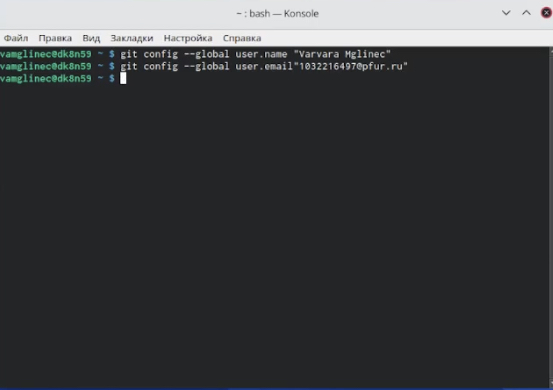

---
## Front matter
title: "Oтчёт по лабораторной работе №3"
subtitle: "*дисциплина:операционные системы*"
author: "Мглинец Варвара Александровна"

## Generic otions
lang: ru-RU
toc-title: "Содержание"

## Bibliography
bibliography: bib/cite.bib
csl: pandoc/csl/gost-r-7-0-5-2008-numeric.csl

## Pdf output format
toc: true # Table of contents
toc-depth: 2
lof: true # List of figures
lot: true # List of tables
fontsize: 12pt
linestretch: 1.5
papersize: a4
documentclass: scrreprt
## I18n polyglossia
polyglossia-lang:
  name: russian
  options:
	- spelling=modern
	- babelshorthands=true
polyglossia-otherlangs:
  name: english
## I18n babel
babel-lang: russian
babel-otherlangs: english
## Fonts
mainfont: PT Serif
romanfont: PT Serif
sansfont: PT Sans
monofont: PT Mono
mainfontoptions: Ligatures=TeX
romanfontoptions: Ligatures=TeX
sansfontoptions: Ligatures=TeX,Scale=MatchLowercase
monofontoptions: Scale=MatchLowercase,Scale=0.9
## Biblatex
biblatex: true
biblio-style: "gost-numeric"
biblatexoptions:
  - parentracker=true
  - backend=biber
  - hyperref=auto
  - language=auto
  - autolang=other*
  - citestyle=gost-numeric
## Pandoc-crossref LaTeX customization
figureTitle: "Рис."
tableTitle: "Таблица"
listingTitle: "Листинг"
lofTitle: "Список иллюстраций"
lotTitle: "Список таблиц"
lolTitle: "Листинги"
## Misc options
indent: true
header-includes:
  - \usepackage{indentfirst}
  - \usepackage{float} # keep figures where there are in the text
  - \floatplacement{figure}{H} # keep figures where there are in the text
---

# Цель работы
Частично изучить идеологию некоторые средства контроля версий (VCS). Получить некоторые умения работы с git.

# Выполнение лабораторной работы

1) Для начала необходимо задать свою имя и свою почту.

{ #fig:001 width=70% }

2) Настроим utf-8 в выводе сообщений git, верификацию и подписание коммитов git,  зададим имя начальной ветки (будем называть её master), настроим параметры autocrlf и safecrlf:

{ #fig:002 width=70% }

3) Создадим ключи sshи pgp

{ #fig:003 width=70% }

{ #fig:004 width=70% }

4) Выводим список ключей и копируем отпечаток приватного ключа:

{ #fig:005 width=70% }

5) Cкопируем сгенерированный PGP ключ в буфер обмена:

{ #fig:006 width=70% }

6) Далее клонируем нужный репозиторий:

{ #fig:007 width=70% }

7) Удаляем лишние файлы, создаём необходимые каталоги и отправляем файлы на сервер:

{ #fig:008 width=70% }

{ #fig:009 width=70% }

# Вывод

Я приобрела минимальные навыки работы с системой контроля версий git, а также зарегистрировалась на github.

::: {#refs}
:::
