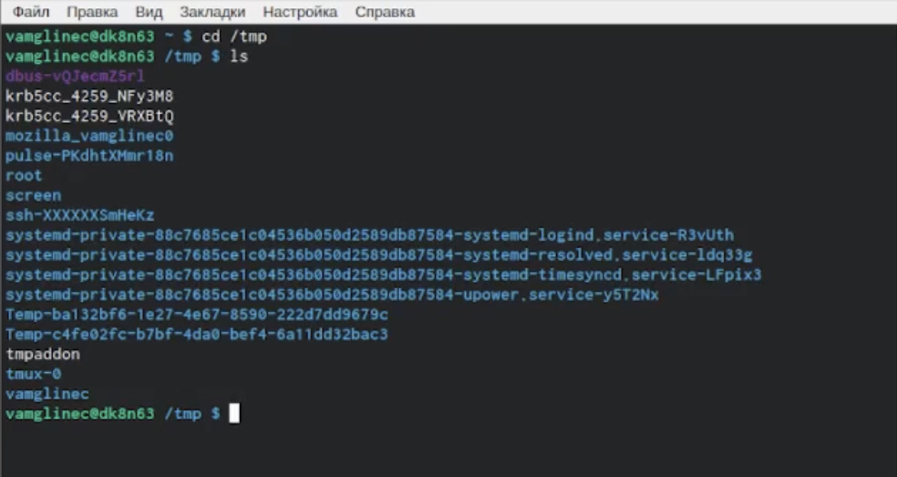
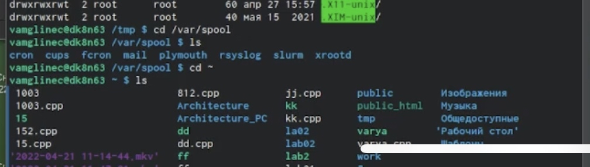
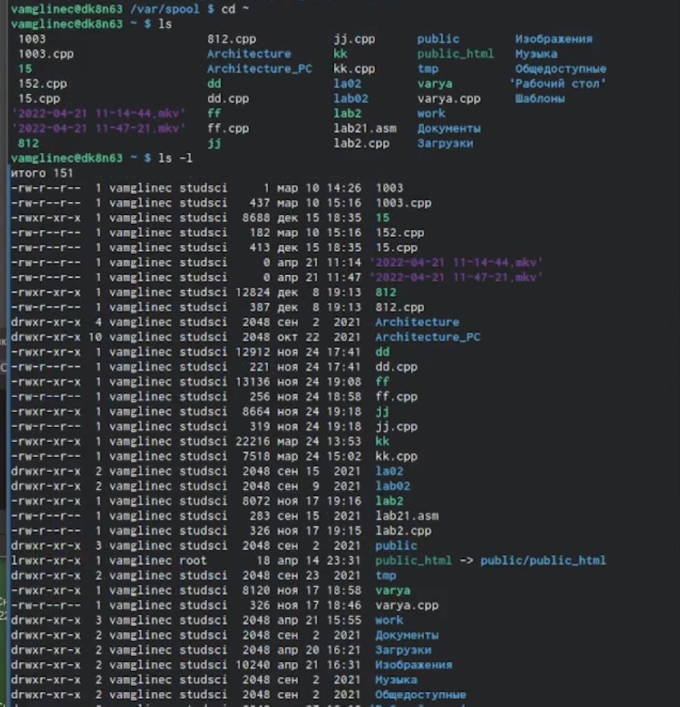
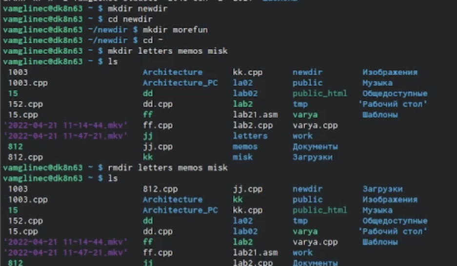
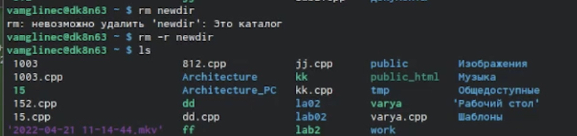
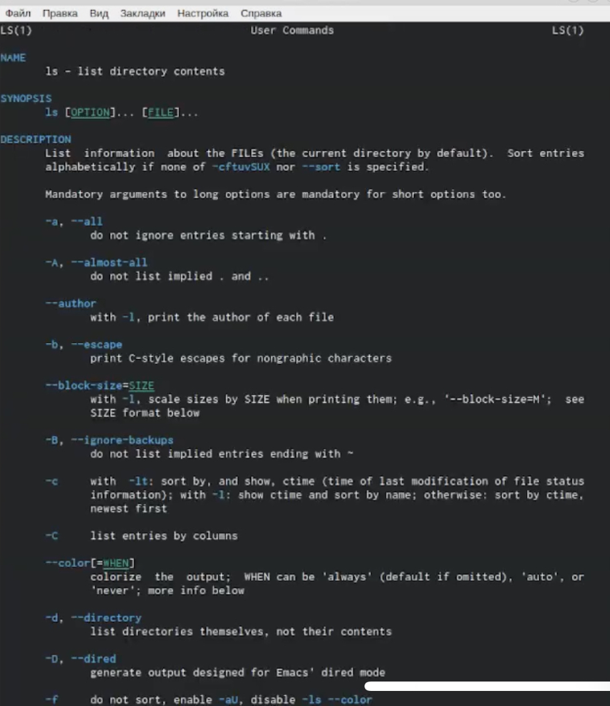
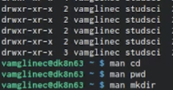
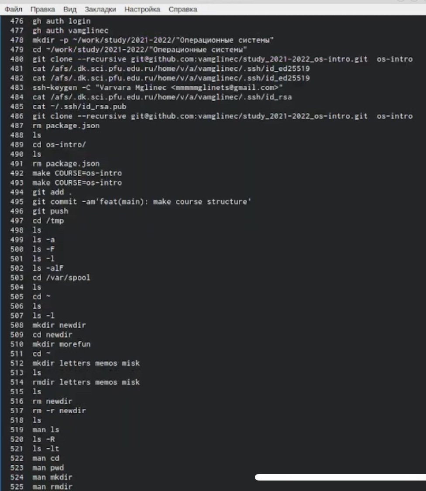
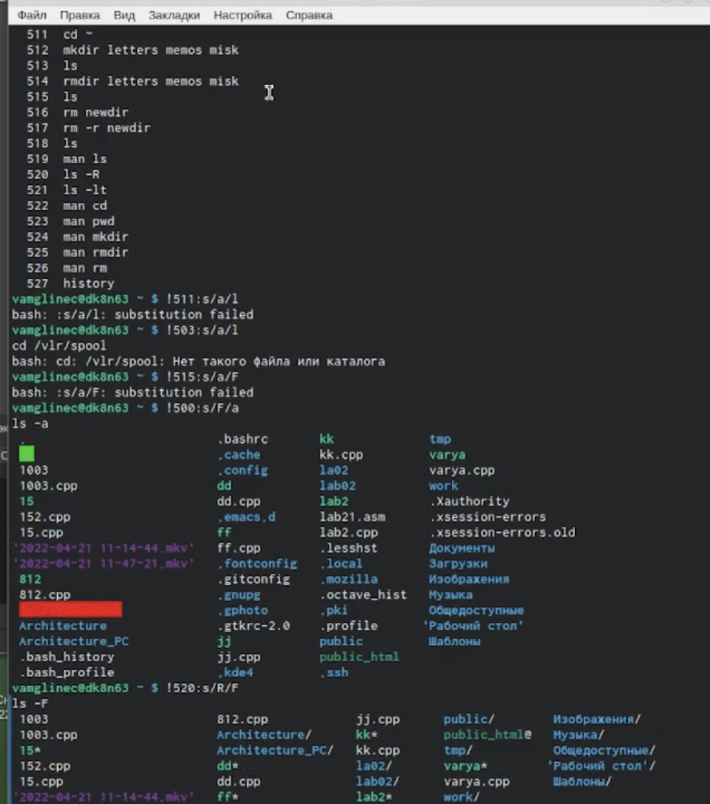

---
## Front matter
title: "Отчёт по лабораторной работе №4"
subtitle: "*дисциплина:операционные системы*"
author: "Мглинец Варвара Александровна"

## Generic otions
lang: ru-RU
toc-title: "Содержание"

## Bibliography
bibliography: bib/cite.bib
csl: pandoc/csl/gost-r-7-0-5-2008-numeric.csl

## Pdf output format
toc: true # Table of contents
toc-depth: 2
lof: true # List of figures
lot: true # List of tables
fontsize: 12pt
linestretch: 1.5
papersize: a4
documentclass: scrreprt
## I18n polyglossia
polyglossia-lang:
  name: russian
  options:
	- spelling=modern
	- babelshorthands=true
polyglossia-otherlangs:
  name: english
## I18n babel
babel-lang: russian
babel-otherlangs: english
## Fonts
mainfont: PT Serif
romanfont: PT Serif
sansfont: PT Sans
monofont: PT Mono
mainfontoptions: Ligatures=TeX
romanfontoptions: Ligatures=TeX
sansfontoptions: Ligatures=TeX,Scale=MatchLowercase
monofontoptions: Scale=MatchLowercase,Scale=0.9
## Biblatex
biblatex: true
biblio-style: "gost-numeric"
biblatexoptions:
  - parentracker=true
  - backend=biber
  - hyperref=auto
  - language=auto
  - autolang=other*
  - citestyle=gost-numeric
## Pandoc-crossref LaTeX customization
figureTitle: "Рис."
tableTitle: "Таблица"
listingTitle: "Листинг"
lofTitle: "Список иллюстраций"
lotTitle: "Список таблиц"
lolTitle: "Листинги"
## Misc options
indent: true
header-includes:
  - \usepackage{indentfirst}
  - \usepackage{float} # keep figures where there are in the text
  - \floatplacement{figure}{H} # keep figures where there are in the text
---

# Цель работы

Приобретение практических навыков взаимодействия пользователя с системой посредством командной строки

# Выполнение лабораторной работы

1) Переходим в каталог tmp и с помощью команды ls  выводим на экран его содержимое

{ #fig:001 width=70% }

2) Определяем, есть ли в каталоге /var/spool подкаталог с именем cron. Переходим в домашний каталог и выводим на экран его содержимое.Определяем,кто является владельцем файлов и подкаталогов

{ #fig:002 width=70% }

3) В домашнем каталоге создаем новый каталог с именем newdir. В каталоге~/newdir создаем новый каталог с именем morefun

{ #fig:003 width=70% }

4) В домашнем каталоге создаем одной командой три новых каталога с именами letters,memos,misk.Затем удаляем эти каталоги одной командой

{ #fig:004 width=70% }

5) Пробуем удалить ранее созданный каталог~/newdir командой rm. Каталог не был удалён. Удаляем каталог~/newdir/morefun из домашнего каталога. Проверяем,был ли каталог удалён

{ #fig:005 width=70% }

6) С помощью команды man определяем, какую опцию команды ls нужно использовать для просмотра содержимое не только указанного каталога,но и подкаталогов,входящих в него.С помощью команды man определяем набор опций команды ls,позволяющий отсортировать по времени последнего изменения выводимый список содержимого каталога с развёрнутым описанием файлов

{ #fig:006 width=70% }

7) Используем команду man для просмотра описания следующих команд:cd,pwd,mkdir,rmdir,rm. Поясняем основные опции этих команд

{ #fig:007 width=70% }

8) Используя информацию,полученную при помощи команды history,выполняем модификацию и исполнение нескольких команд из буфера команд

{ #fig:008 width=70% }

{ #fig:009 width=70% }

# Выводы
Я приобрела практические навыки взаимодействия пользователя с системой посредством командной строки

::: {#refs}
:::
