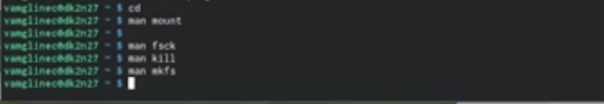

---
## Front matter
title: "Отчёт по лабораторной работе №5"
subtitle: "*дисциплина:операционные системы*"
author: "Мглинец Варвара"

## Generic otions
lang: ru-RU
toc-title: "Содержание"

## Bibliography
bibliography: bib/cite.bib
csl: pandoc/csl/gost-r-7-0-5-2008-numeric.csl

## Pdf output format
toc: true # Table of contents
toc-depth: 2
lof: true # List of figures
lot: true # List of tables
fontsize: 12pt
linestretch: 1.5
papersize: a4
documentclass: scrreprt
## I18n polyglossia
polyglossia-lang:
  name: russian
  options:
	- spelling=modern
	- babelshorthands=true
polyglossia-otherlangs:
  name: english
## I18n babel
babel-lang: russian
babel-otherlangs: english
## Fonts
mainfont: PT Serif
romanfont: PT Serif
sansfont: PT Sans
monofont: PT Mono
mainfontoptions: Ligatures=TeX
romanfontoptions: Ligatures=TeX
sansfontoptions: Ligatures=TeX,Scale=MatchLowercase
monofontoptions: Scale=MatchLowercase,Scale=0.9
## Biblatex
biblatex: true
biblio-style: "gost-numeric"
biblatexoptions:
  - parentracker=true
  - backend=biber
  - hyperref=auto
  - language=auto
  - autolang=other*
  - citestyle=gost-numeric
## Pandoc-crossref LaTeX customization
figureTitle: "Рис."
tableTitle: "Таблица"
listingTitle: "Листинг"
lofTitle: "Список иллюстраций"
lotTitle: "Список таблиц"
lolTitle: "Листинги"
## Misc options
indent: true
header-includes:
  - \usepackage{indentfirst}
  - \usepackage{float} # keep figures where there are in the text
  - \floatplacement{figure}{H} # keep figures where there are in the text
---

# Цель работы

Ознакомление с файловой системой Linux, её структурой, именами и содержанием
каталогов. Приобретение практических навыков по применению команд для работы
с файлами и каталогами, по управлению процессами (и работами), по проверке использования диска и обслуживанию файловой системы.

# Шаг 1

1) Копирование файла в текущем каталоге. Скопируем файл ~/abc1 в файл april и в файл may

{ #fig:001 width=70% }

2)Копирование нескольких файлов в каталог. Скопируем файлы april и may в каталог monthly. Для рекурсивного копирования каталогов, содержащих файлы, используется команда cp с опцией r.

{ #fig:002 width=70% }

3) Переименуем файлов в текущем каталоге. Изменим название файла april на july в домашнем каталоге, перемещаем файл july в каталог monthly.00,  переименовываем каталог monthly.00 в monthly.01, далее перемещаем каталог monthly.01 в каталог reports и переименовываем каталог
reports/monthly.01 в reports/monthly. После этого создаём файл ~/may с правом выполнения для владельца и лишем владельца прав на выполнение. Далее создаём каталог monthly с запретом на чтение для членов группы и всех остальных пользователей и создаём файл ~/abc1 с правом записи для членов группы.

{ #fig:003 width=70% }

# Шаг 2

1) Скопируем файл /usr/include/sys/io.h в домашний каталог и назовём его
equipment. 

{ #fig:004 width=70% }

2) В домашнем каталоге создаём директорию ~/ski.plases.

{ #fig:005 width=70% }

3) Перемещаем файл equipment в каталог ~/ski.plases, переименовываем файл ~/ski.plases/equipment в ~/ski.plases/equiplist.Создаём в домашнем каталоге файл abc1 и копируем его в каталог ~/ski.plases, называем его equiplist2. Создаём каталог с именем equipment в каталоге ~/ski.plases
Перемещаем файлы ~/ski.plases/equiplist и equiplist2 в каталог
~/ski.plases/equipment.

{ #fig:006 width=70% }

4) Создаём и переместите каталог ~/newdir в каталог ~/ski.plases и называем его plans.

{ #fig:007 width=70% }

# Шаг 3

Создаём нужные файлы и определяем опции команды chmod, необходимые для того, чтобы присвоить перечисленным ниже файлам выделенные права доступа, считая, что в начале таких прав нет:

- 3.1. drwxr--r-- ... australia
- 3.2. drwx--x--x ... play
- 3.3. -r-xr--r-- ... my_os
- 3.4. -rw-rw-r-- ... feathers

{ #fig:008 width=70% }

# Шаг 4

1) Просматриваем содержимое файла /etc/password и копируем файл ~/feathers в файл ~/file.old, а после перемещаем файл ~/file.old в каталог ~/play.

{ #fig:009 width=70% }
 
2) Копируем каталог ~/play в каталог ~/fun и перемещаем каталог ~/fun в каталог ~/play и называем его games.Лишаем владельца файла ~/feathers права на чтение, после даём владельцу файла ~/feathers право на чтение.
Лишаем владельца каталога ~/play права на выполнение.Переходим в каталог ~/play.После возвращаем владельцу каталога ~/play право на выполнение.

{ #fig:010 width=70% }

# Шаг 5 

Прочитаем man по командам mount, fsck, mkfs, kill 

{ #fig:011 width=70% }

# Выводы

Я ознакомилась с файловой системой Linux, её структурой, именами и содержанием каталогов. Приобрела практические навыки по применению команд для работы с файлами и каталогами, по управлению процессами (и работами), по проверке использования диска и обслуживанию файловой системы.

::: {#refs}
:::
