---
## Front matter
title: "Отчёт по этапу 3 индивидуального проекта"
subtitle: "*дисциплина:операционные системы*"
author: "Мглинец Варвара"

## Generic otions
lang: ru-RU
toc-title: "Содержание"

## Bibliography
bibliography: bib/cite.bib
csl: pandoc/csl/gost-r-7-0-5-2008-numeric.csl

## Pdf output format
toc: true # Table of contents
toc-depth: 2
lof: true # List of figures
lot: true # List of tables
fontsize: 12pt
linestretch: 1.5
papersize: a4
documentclass: scrreprt
## I18n polyglossia
polyglossia-lang:
  name: russian
  options:
	- spelling=modern
	- babelshorthands=true
polyglossia-otherlangs:
  name: english
## I18n babel
babel-lang: russian
babel-otherlangs: english
## Fonts
mainfont: PT Serif
romanfont: PT Serif
sansfont: PT Sans
monofont: PT Mono
mainfontoptions: Ligatures=TeX
romanfontoptions: Ligatures=TeX
sansfontoptions: Ligatures=TeX,Scale=MatchLowercase
monofontoptions: Scale=MatchLowercase,Scale=0.9
## Biblatex
biblatex: true
biblio-style: "gost-numeric"
biblatexoptions:
  - parentracker=true
  - backend=biber
  - hyperref=auto
  - language=auto
  - autolang=other*
  - citestyle=gost-numeric
## Pandoc-crossref LaTeX customization
figureTitle: "Рис."
tableTitle: "Таблица"
listingTitle: "Листинг"
lofTitle: "Список иллюстраций"
lotTitle: "Список таблиц"
lolTitle: "Листинги"
## Misc options
indent: true
header-includes:
  - \usepackage{indentfirst}
  - \usepackage{float} # keep figures where there are in the text
  - \floatplacement{figure}{H} # keep figures where there are in the text
---

# Выполнение лабораторной работы

В файле skills.md перехожу по ссылке, где нам предоставлена информация о
всех наборах иконок, воспользуемся набором emoji

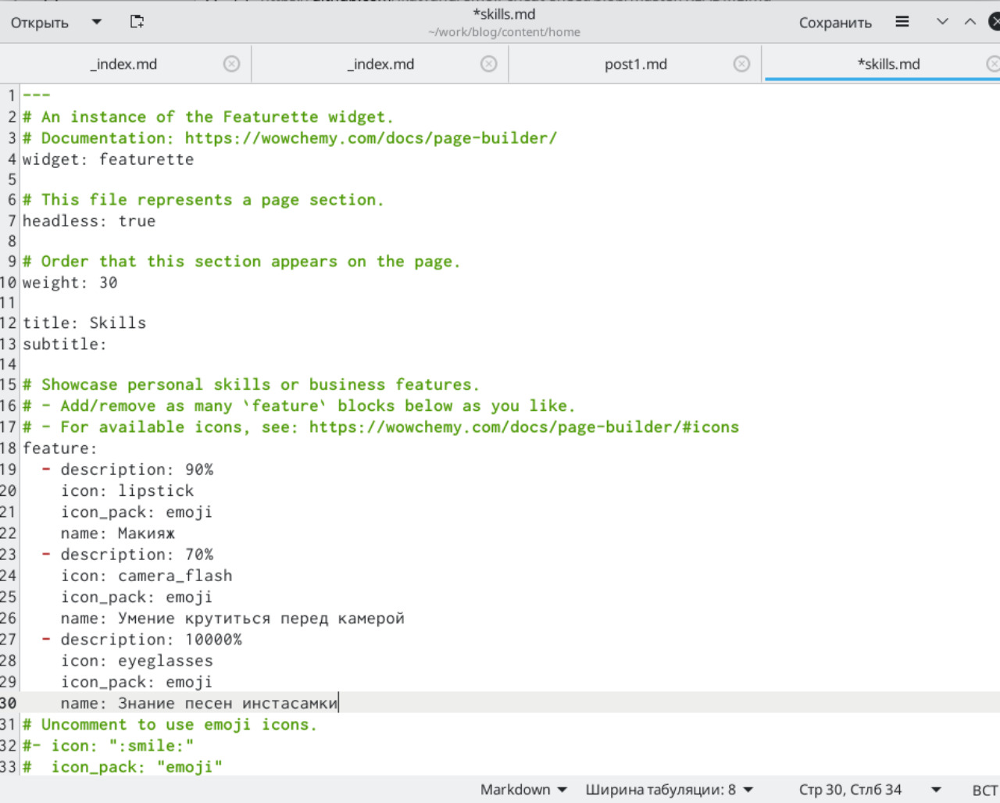{ #fig:001 width=70% }

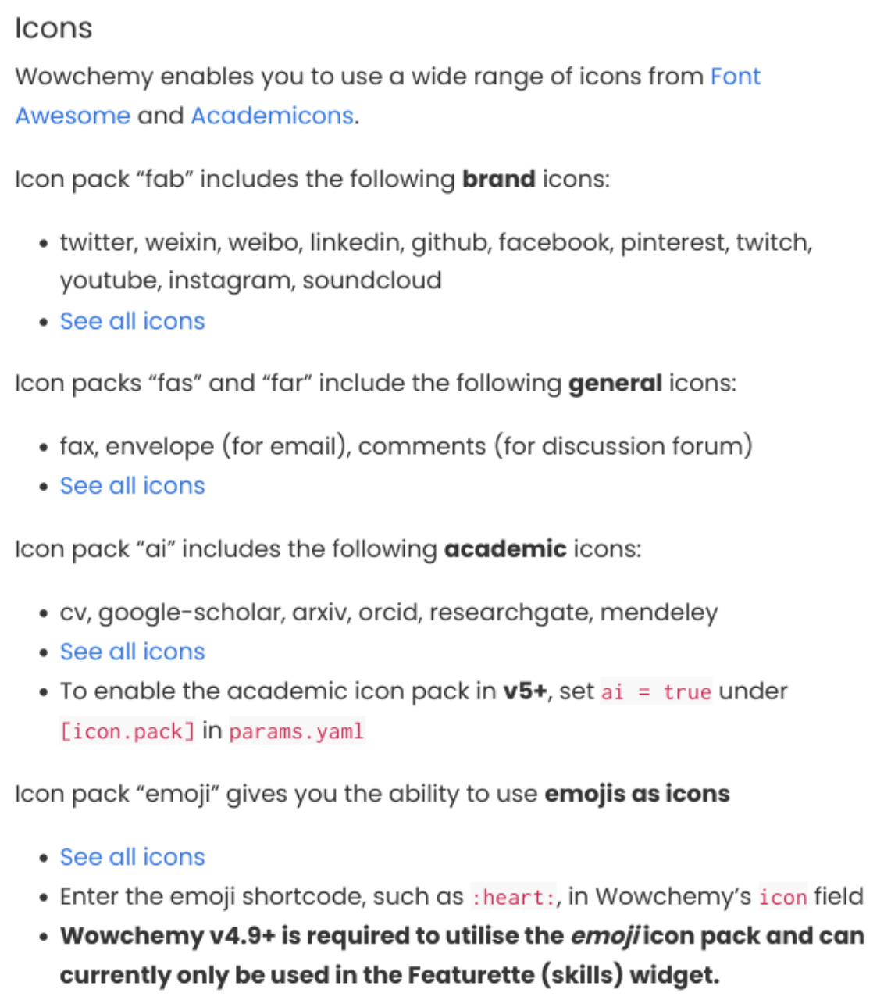{ #fig:002 width=70% }

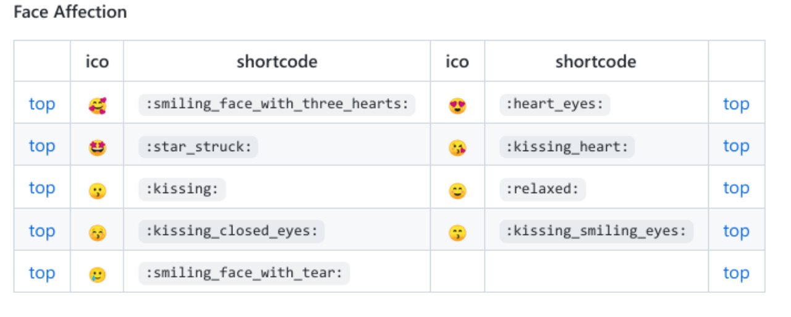{ #fig:003 width=70% }

Вносим изменения в наш файл, все поля заполняем по форме, которая представлена в комментариях 

{ #fig:004 width=70% }

Открываю терминал, с помощью команды ~/bin/hugo server проверяю исправность работы сервера и не допустила ли я ошибок. Вызываю ~/bin/hugo
Перехожу по ссылке, сгенерированной с помощью команды ~/bin/hugo server,
здесь с нашим сайтом будут происходить все первоначальные изменения (после
каждого вызова команды ~/bin/hugo server). Посмотрим, что изменилось

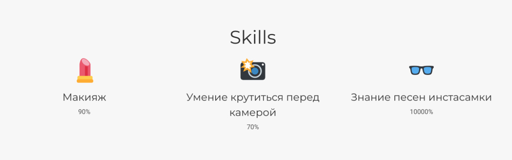{ #fig:005 width=70% }

Вношу изменения в файл experience.md

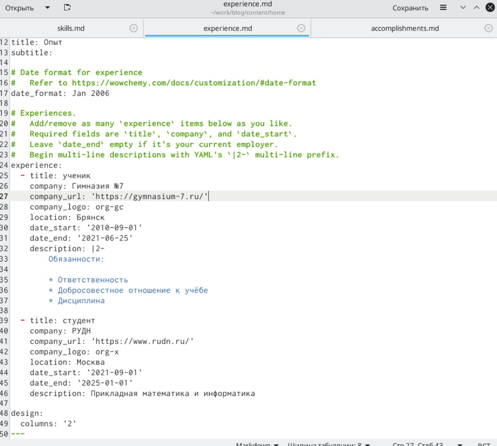{ #fig:006 width=70% }

Открываю терминал, с помощью команды ~/bin/hugo server проверяю исправность работы сервера и не допустила ли я ошибок. Вызываю ~/bin/hugo
Перехожу по ссылке, сгенерированной с помощью команды ~/bin/hugo server,
здесь с нашим сайтом будут происходить все первоначальные изменения (после
каждого вызова команды ~/bin/hugo server). Посмотрим, что изменилось

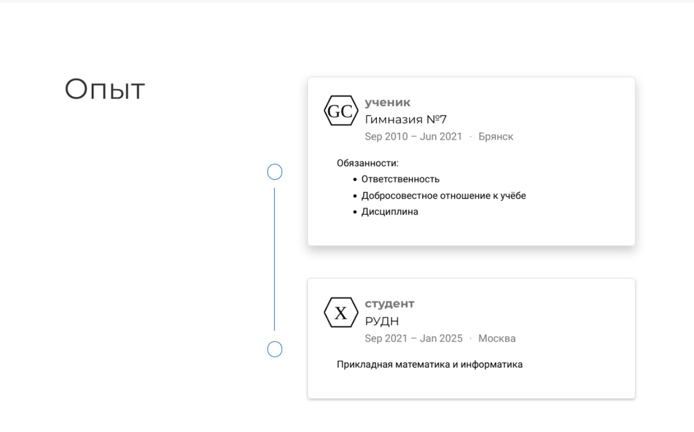{ #fig:007 width=70% }

Вношу изменения в файл accomplishments.md 

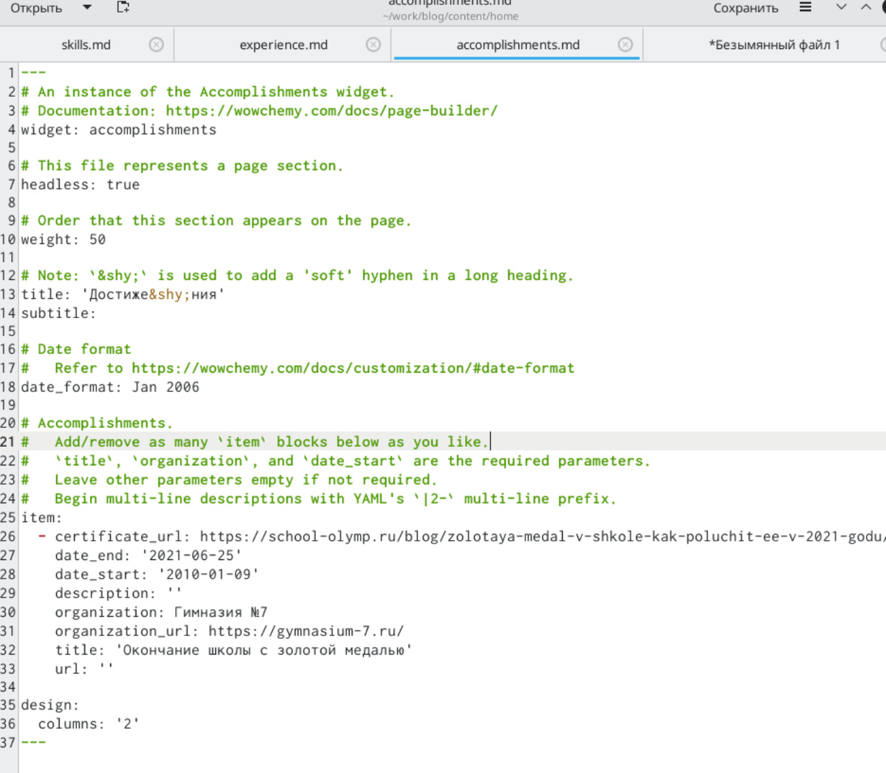{ #fig:008 width=70% }

Открываю терминал, с помощью команды ~/bin/hugo server проверяю исправность работы сервера и не допустила ли я ошибок. Вызываю ~/bin/hugo
Перехожу по ссылке, сгенерированной с помощью команды ~/bin/hugo server,
здесь с нашим сайтом будут происходить все первоначальные изменения (после
каждого вызова команды ~/bin/hugo server). Посмотрим, что изменилось

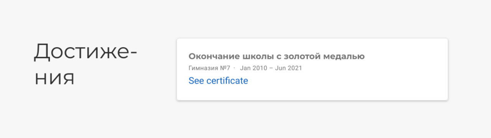{ #fig:009 width=70% }

В терминале с помощью команды hugo создаю новый текстовый документ post2.md в папке post

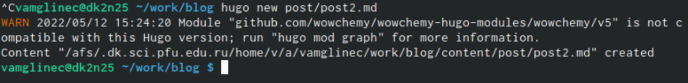{ #fig:010 width=70% }

Открываю файл и вношу изменения

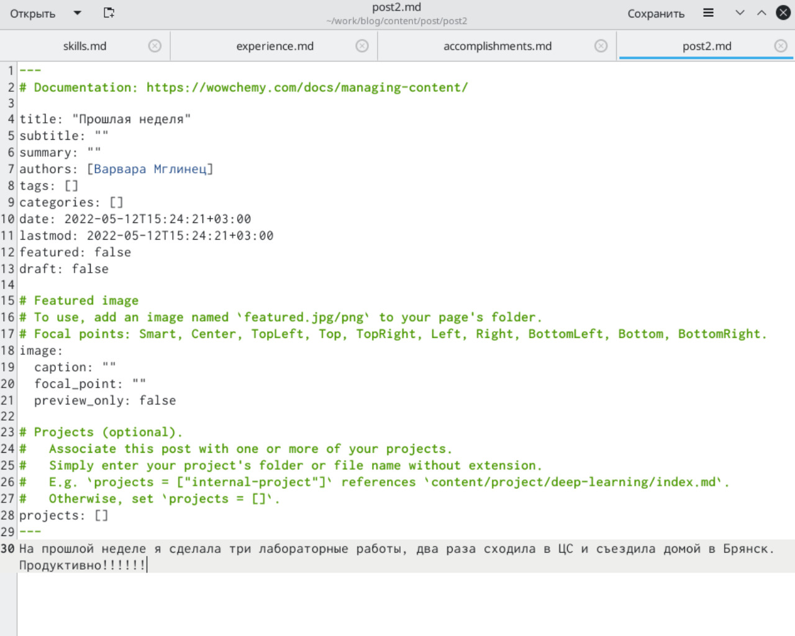{ #fig:011 width=70% }

{ #fig:012 width=70% }

В терминале с помощью команды hugo создаю новый текстовый документ post2.md в папке post

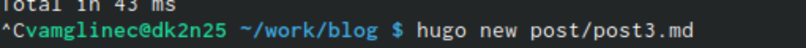{ #fig:013 width=70% }

Открываю файл и вношу изменения

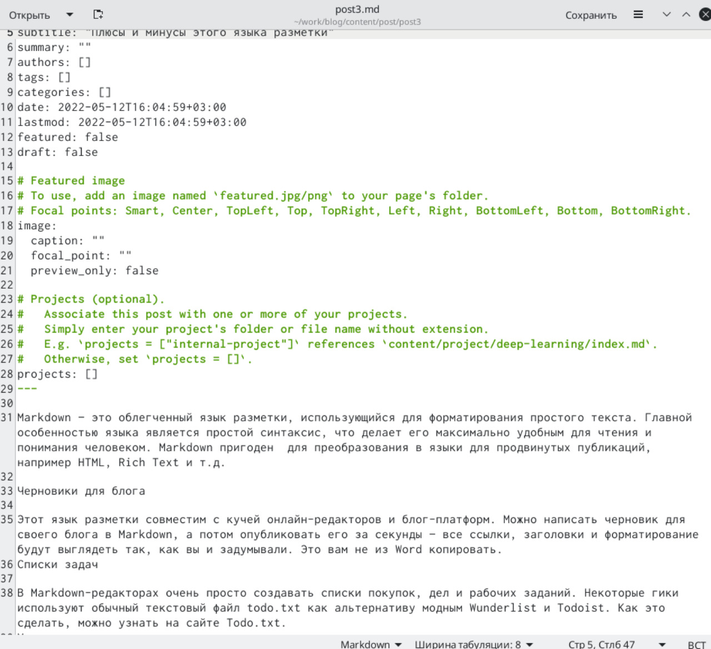{ #fig:014 width=70% }

{ #fig:015 width=70% }

# Выводы

В ходе выполнения данной лабораторной работы я научилась добавлять к сайту
достижения, поняла, как добавлять информацию о навыках, об опыте.

# Список литературы{.unnumbered}

::: {#refs}
:::
